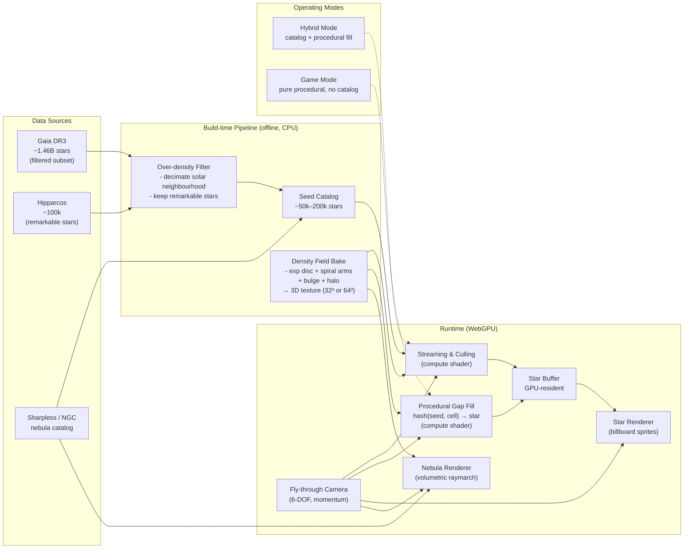

# Galaxy Fly-Through Engine — Development Plan

**Status:** Draft v0.1
**Scope:** Personal project, solo developer, week-scale milestones
**Target runtime:** WebGPU (Chrome/Edge 113+, Safari 17+, Firefox Nightly)
**Modes:** Hybrid (catalog-seeded + procedural fill) · Pure procedural game mode

---

## 1. Executive Summary

This document describes the development of a real-time, WebGPU-based galaxy fly-through engine. The engine renders up to one million stars interactively while preserving a *realistic galactic density distribution* — and crucially, still looks correct when the visible object count is dialled down to ~10k for low-end devices or "game mode."

The core problem with raw star catalogs (Gaia DR3, Hipparcos) is that they are *not* a uniform sample of the Milky Way: completeness falls off steeply with distance from the Sun, so a naive catalog download produces an over-dense blob centred on Earth with empty galaxy everywhere else. This plan solves that by:

1. **Filtering** catalog stars to remove the solar-neighbourhood over-density.
2. **Filling gaps** with stable hash-based procedural stars sampled from a physically-motivated density field (exponential disk + spiral arms + bulge + halo).
3. **Scaling gracefully** — the *density field* is the source of truth, not the star count, so 10k or 1M stars both render with the same visual density.
4. **Supporting two modes** — hybrid (real catalog + procedural) and pure-procedural game mode (no catalog at all, fully seeded galaxy).

The architecture is WebGPU-first: compute shaders for procedural generation, culling, and density sampling; render pipeline for bill-boarded star sprites and volumetric raymarched nebulae.

---

## 2. Problem Statement & Research Findings

### 2.1 The Catalog Bias Problem

The user's framing is correct: downloaded star catalogs are spatially biased. Specifically:

- **Gaia DR3** contains ~1.46 billion sources with a limiting magnitude of G ≈ 21, but "the catalogue is essentially complete between G=12 and G=17" and has "an ill-defined faint magnitude limit, which depends on celestial position" ([dc.g-vo.org](https://dc.g-vo.org), Gaia EDR3 documentation).
- **Distance completeness collapses rapidly**: "at a distance of about 100 pc, the coolest stars become too faint for Gaia's survey limit" ([ESA Cosmos, Gaia EDR3](https://www.cosmos.esa.int)). In practice Gaia is *complete* only inside ~100 pc for cool dwarfs and becomes heavily incomplete beyond 1 kpc; useful sampling reaches ~3 kpc for bright tracers ([Vieira et al. 2023](https://www.research.unipd.it)).
- **Hipparcos/Tycho-2** (~100k stars) is all-sky but sparse beyond 1 kpc.

**Consequence:** If you download Gaia DR3 and render every star at its true 3D position, you get a bright dense blob centred on the Sun, fading to nothing at a few kiloparsecs. The rest of the Milky Way — the 100+ kpc extent, the spiral arms, the bulge — is invisible. This is *exactly* the failure mode the user described.

### 2.2 How Real Projects Solve It

Three precedents are directly relevant:

1. **Elite Dangerous — "Stellar Forge"** ([polygon.com](https://www.polygon.com), [ctrl500.com](https://ctrl500.com), [perthobservatory.com.au](https://perthobservatory.com.au)). Frontier Developments built a 1:1 scale Milky Way with ~400 billion star systems. They seeded it with ~160,000 real Hipparcos stars (the "remarkable" stars) and *procedurally generated* the rest using physics-based rules — stellar initial mass functions, metallicity gradients, age distributions. The galaxy is not stored; it is regenerated deterministically from a seed on demand.

2. **SpaceEngine** ([spaceengine.org](https://spaceengine.org)). Uses procedural galaxies with seeded hierarchical generation: galaxy → arm → cloud → star system. Density fields drive the placement; no catalog dependency at all in default mode.

3. **TRILEGAL / Besançon Galaxy Model** ([aanda.org](https://www.aanda.org), [perso.astrophy.u-bordeaux.fr](https://perso.astrophy.u-bordeaux.fr)). Academic synthetic-population codes that generate *mock star catalogs* from a Milky Way density model. Four populations are modelled — thin disc, thick disc, bulge, halo — each with its own density distribution and stellar population synthesis. TRILEGAL is open-source and is the standard reference for "what should be here."

4. **Inria HAL 2026 — "Massive Procedural Rendering of Stars on the GPU"** ([inria.hal.science](https://inria.hal.science)). A direct precedent: real-time procedural generation and visualisation of a virtual galaxy entirely on the GPU. Validates the WebGPU-compute approach.

### 2.3 The Milky Way Density Model

The accepted model for the Milky Way's stellar mass distribution is a multi-component density field ([ned.ipac.caltech.edu](https://ned.ipac.caltech.edu), [Britannica](https://www.britannica.com)):

- **Thin disc**: exponential in radius (scale length `h_R ≈ 2.6 kpc`) and exponential in vertical height (`h_z ≈ 300 pc`).
- **Thick disc**: similar exponential, larger scales (`h_R ≈ 3.5 kpc`, `h_z ≈ 900 pc`), lower normalisation.
- **Bulge / bar**: triaxial, non-exponential, concentrated within ~3 kpc of the centre ([Portail 2016](https://academic.oup.com)).
- **Stellar halo**: power-law `r^-3.5`, low density but extends to 100 kpc+.
- **Spiral arms**: logarithmic spiral perturbations superimposed on the disc, two-armed (Perseus, Sagittarius) plus smaller branches.

The combined density is the *ground truth* the procedural generator must sample from. This is what makes the scene look like a galaxy rather than a uniform star field.

### 2.4 Stable Hash-Based Generation

For deterministic, stateless, parallel-friendly procedural generation, the standard is to use an integer hash function rather than a PRNG ([reedbeta.com](https://www.reedbeta.com), [pcg.wikidot.com](https://pcg.wikidot.com)):

- **Wang hash** — fast 32-bit integer hash, good enough for GPU seeding.
- **PCG (Permuted Congruential Generator)** — better statistical quality, recommended by Nathan Reed for GPU rendering.
- **Hash-vs-PRNG**: "Hash functions create a random number solely based on an input, with no dependency on previous queries" — exactly what we need for parallel WebGPU compute.

This means star `#123456789` is *always* at the same position, with the same colour, magnitude, and proper motion, no matter which machine renders it or in what order. The galaxy is defined by (seed, density model, hash function) and is reproducible across runs.

---

## 3. Architecture Overview

The architecture has three stages:

1. **Build-time (offline)** — Filter raw catalogs, bake a low-resolution 3D density texture, and ship a small "seed catalog" of remarkable stars and named nebulae.
2. **Streaming & procedural fill (runtime, compute)** — A WebGPU compute shader walks cells around the camera, queries the density texture, and either reads catalog stars or generates procedural stars via stable hash. Stars land in a GPU buffer.
3. **Render (runtime, graphics)** — A billboard sprite pipeline draws stars; a volumetric raymarcher draws nebulae; a 6-DOF momentum camera handles fly-through.

The density field is the single source of truth for *where stars should be*. The actual count is a budget parameter — 10k or 1M, the distribution looks the same.

---

## 4. Data Pipeline

### 4.1 Catalog Acquisition

The plan assumes a **hybrid** source, as the user selected:

| Source | Role | Approx. count | Notes |
|---|---|---|---|
| Hipparcos / Tycho-2 | "Remarkable" named stars | ~100k | All-sky, well-measured, includes bright stars Gaia saturates on |
| Gaia DR3 (subset) | Real nearby stars with proper motion | ~200k filtered | Cut to G < 12 to avoid distance bias |
| NGC / Sharpless / Messier | Named clusters & nebulae | ~1k | Catalogue of remarkable objects |
| TRILEGAL mock catalogue | Optional calibration source | n/a | Used to *validate* the density model, not shipped |

Gaia DR3 is downloaded once via the ESA archive or the `astroquery` Python package. The full release is ~1.5 TB, so the build script applies a magnitude cut (`G < 12`) and a quality cut (`parallax_over_error > 5`) before storage. This reduces the working set to roughly 50–200 MB and *intrinsically caps* the solar-neighbourhood over-density problem by removing the faint, distant-incomplete sources that bloat the local count.

### 4.2 Filtering Strategy (Anti-Bias)

The filtering stage implements three policies:

1. **Magnitude-completeness cut.** Keep only stars brighter than the magnitude at which Gaia is complete across the whole sky. This prevents "more stars near Earth just because Gaia sees more there." The cut is configurable and defaults to G ≤ 12.

2. **Radial decimation.** Inside 100 pc, Gaia is over-complete. The filter applies a stochastic decimation factor `f(r) = (r / r_0)²` for `r < r_0` (r_0 = 100 pc). This thins the solar neighbourhood down to a density consistent with the rest of the catalog.

3. **Remarkable-star protection.** A whitelist (Hipparcos, NGC, named stars) bypasses the decimation so that Betelgeuse, Sirius, the Pleiades, etc. always appear at their true position.

### 4.3 Density Field Bake

After filtering, a separate offline step bakes the Milky Way density field into a 3D texture. The density model is:

- Thin disc: `ρ_d(r, z) = ρ₀ · exp(-r / h_R) · exp(-|z| / h_z)` with `h_R = 2.6 kpc, h_z = 300 pc`
- Thick disc: same form, `h_R = 3.5 kpc, h_z = 900 pc`, normalisation 0.12 · ρ₀
- Bulge: triaxial bar model (Dwek 1995 form), extent ~3 kpc
- Halo: `ρ_h(r) = ρ_h0 · (r / a_h)^-3.5` for `r > a_h`, `a_h = 1 kpc`
- Spiral arms: multiplicative perturbation `1 + A·cos(m·φ + β·ln(r/r_s))` with m = 2, A ≈ 0.2

The combined density is sampled on a 64×64×32 grid covering the galactic region of interest (e.g. 30 kpc × 30 kpc × 4 kpc), normalised, and shipped as a 16-bit float 3D texture. This texture is ~256 KB and is the only astrophysical data the runtime needs (besides the seed catalog).

### 4.4 Why This Solves the Bias

Because the runtime samples *from the density field*, not from the catalog, the visual distribution is the physically-correct one regardless of how incomplete the catalog is. The catalog contributes the *names and positions of remarkable stars*; the density field contributes the *overall structure*. The catalog is decoration; the model is the truth.

---

## 5. Procedural Generation Strategy

### 5.1 Stable Hash → Deterministic Star

Every procedural star is identified by a 64-bit key `(seed, cell_id, slot)` where:

- `seed` — galaxy-wide seed (one uint32, set at session start; differs between hybrid and game modes).
- `cell_id` — spatial cell index, computed from galactic XYZ (e.g. cell size = 50 pc).
- `slot` — index within the cell (0..N-1, where N is the expected star count for that cell).

The hash function takes `(seed, cell_id, slot)` and returns a 32-bit pseudo-random value. A second hash call returns a 64-bit float in [0,1] used for sampling. Following Nathan Reed's recommendation, we use **PCG hash** (or Wang hash as a faster fallback) because both are stateless and parallel-friendly — perfect for a WebGPU compute shader with thousands of threads.

This means star `(seed=42, cell=(15,-3,2), slot=7)` is *always* the same star — same position within the cell, same colour, same magnitude. Move the camera, restart the page, switch machines: it doesn't matter. The galaxy is fully reproducible.

### 5.2 Density-Driven Sampling

For each spatial cell around the camera:

1. Compute the expected star count `λ = density(cell_centre) × cell_volume × luminosity_bias`.
2. If `λ < 1`: use rejection sampling — generate one star with probability `λ`, skip otherwise.
3. If `λ ≥ 1`: generate `floor(λ)` stars plus one extra with probability `frac(λ)`.

The position within the cell is a stratified sample: hash the slot to get a 3D point in [0,1]³, then map to cell-local XYZ. This gives uniform coverage within a cell with no clumping.

### 5.3 Star Properties

Each procedural star is assigned:

- **Position** — from hash (above).
- **Apparent magnitude** — sampled from a Salpeter initial mass function, converted to absolute magnitude, then apparent magnitude from distance.
- **Colour (B-V)** — sampled from a colour-magnitude diagram appropriate to the local population (disc vs. bulge).
- **Proper motion** — small random vector, biased toward the local galactic rotation.
- **Variability flag** — ~5% of stars marked as variable, with phase and amplitude from hash.

### 5.4 Two Operating Modes

| Mode | Catalog used | Procedural used | Use case |
|---|---|---|---|
| **Hybrid** | Yes (filtered Gaia + Hipparcos + NGC) | Yes (gap-fill beyond catalog completeness) | "Realistic" — see the actual Pleiades, Orion, etc. at true positions |
| **Game mode** | No catalog | Yes (entire galaxy) | Pure procedural exploration, fast startup, no asset download |

Both modes share the same density field, same hash function, same render pipeline. The only difference is whether catalog stars are merged into the star buffer ahead of the procedural fill. This means *visual density is identical between modes* — only the "named landmarks" differ.

### 5.5 Density-Preserving Count Scaling

The user's requirement is explicit: total object count must be adjustable (e.g. down to 10k) without making the density look wrong. The strategy:

- The **density field** defines relative density everywhere. It is the truth.
- The **target star count** `T` is a runtime budget (10k, 100k, 1M).
- A **global scaling factor** `s = T / Λ_total` (where `Λ_total` is the integral of the density field) multiplies every cell's expected count.
- At low budgets, individual cells may be sparse; the *spatial distribution* remains correct because the rejection sampler still preserves the relative probability.

The result: at 10k stars the galaxy looks like a sparse but correctly-shaped galaxy. At 1M stars it looks like a dense, correctly-shaped galaxy. The user can trade visual richness for frame rate without corrupting the structure.

---

## 6. Nebulae and Clouds

Nebulae are first-class citizens, not afterthoughts. They are split into two classes:

### 6.1 Catalogued Nebulae (Hybrid Mode Only)

A short list of named nebulae (Orion, Lagoon, Eagle, Carina, etc.) is shipped as data. Each entry has:

- Position (galactic XYZ)
- Bounding radius
- Colour palette (peak emission wavelength)
- Density multiplier

These render with a higher-quality volumetric pass and are always drawn when in view.

### 6.2 Procedural Nebulae

The density field includes a separate "ISM density" channel that tracks where molecular clouds *should* be (concentrated in spiral arms, scale height ~100 pc). The procedural generator samples this channel to spawn low-count, large-radius nebulae in spiral arms. Each procedural nebula is a hash-seeded instance with:

- Centre position (in arm, offset from midplane)
- Three-octave 3D noise field for internal density variation
- Colour tint based on local stellar population (red in HII regions, blue in reflection)

### 6.3 Rendering Technique

Nebulae are rendered with **volumetric raymarching** through a screen-space quad covering their projected bounding volume, following the technique described in [Maxime Heckel's volumetric cloudscapes article](https://blog.maximeheckel.com) and NVIDIA's GPU Gems 3 Chapter 30. The shader:

1. Marches from near to far plane in 32–64 steps.
2. At each step, samples a 3D noise texture (animated FBM) for density.
3. Accumulates emission (coloured by nebula tint × local density) with beer-lambert absorption.
4. Composite over the star background.

This is more expensive than sprite nebulae but is what makes fly-through feel volumetric — the nebula has depth, parallax, and the camera can enter it.

---

## 7. WebGPU Rendering

### 7.1 Why WebGPU

WebGPU was chosen over WebGL because:

- **Compute shaders** are required for hash-based procedural generation and streaming culling on the GPU. WebGL has no compute.
- **Proven at scale**: Kitware demonstrated interactive rendering of a 2-billion-point cloud in WebGPU ([kitware.com](https://www.kitware.com)), and Magnopus published a custom compute-based render pipeline for large point clouds ([magnopus.com](https://www.magnopus.com)).
- **Storage buffers** allow arbitrary-size star data without texture-packing hacks.

A 2026 thesis from TU Wien ([cg.tuwien.ac.at](https://www.cg.tuwien.ac.at)) explicitly evaluates WebGPU point cloud rendering and confirms it outperforms WebGL for large datasets.

### 7.2 Star Rendering Pipeline

The render pipeline uses **billboarded point sprites**:

- Each star is a vertex in a storage buffer with `(position_xyz, magnitude, color_packed, size_hint)`.
- Vertex shader: project to clip space, expand to a quad of size `f(magnitude, distance)` facing the camera.
- Fragment shader: soft circular falloff with optional diffraction spikes for bright stars, plus tone mapping (ACES) for HDR.

A single draw call renders all visible stars. This is the same approach used by Three.js + TSL tutorials for interactive galaxies ([threejsroadmap.com](https://threejsroadmap.com)) and is well within WebGPU's budget for 1M vertices per frame.

### 7.3 Streaming & Culling (Compute)

A compute shader runs each frame:

1. **Camera cell**: compute the camera's current cell in the spatial hash.
2. **Visible cells**: enumerate the K nearest cells (K = 27 by default for a 3×3×3 neighbourhood; configurable).
3. **Catalog stars**: for each cell, look up catalog stars from a GPU-resident buffer; emit to the star buffer if inside the frustum.
4. **Procedural stars**: for each cell, compute expected count `λ`; iterate slots `0..λ-1`; hash each slot; rejection-sample position; emit if inside frustum.
5. **Count buffer**: an atomic counter tracks total emitted stars; if it exceeds the budget (1M), later emitters are dropped silently.

This is the Inria approach: "Massive Procedural Rendering of Stars on the GPU" ([inria.hal.science](https://inria.hal.science)). The compute shader writes stars into a storage buffer; the render pipeline draws them. No CPU roundtrip per frame.

### 7.4 Fly-Through Camera

A 6-DOF camera with momentum:

- WASD translates, mouse drag rotates, scroll wheel controls speed.
- Velocity persists with mild damping (0.92/frame) for smooth fly-through feel.
- Speed is logarithmic — slow near interesting objects, very fast across the galaxy (ly/s to kpc/s in the same gesture).
- A "warp" mode locks the camera to a target star and accelerates toward it.

The camera position drives the streaming compute shader, which means the galaxy is always populated densely near the camera and sparsely far away — naturally adaptive.

---

## 8. Milestones (Personal Project, Week-Scale)

### Week 1 — Foundation
- WebGPU device init, basic render loop, billboard star pipeline.
- Hard-coded 10k star cube, fly-through camera.
- *Deliverable: WebGL-fallback-equivalent demo of a star cube you can fly through.*

### Week 2 — Density Model & Procedural Gen
- Implement PCG hash in WGSL.
- Implement exponential disk + spiral arms density function.
- Compute shader that fills cells with hash-seeded stars.
- *Deliverable: a procedural galaxy (no catalog yet), 100k–1M stars, correct density.*

### Week 3 — Catalog Integration
- Acquire and filter Gaia DR3 subset + Hipparcos.
- Implement radial decimation filter.
- Ship seed catalog as binary asset.
- Compute shader that merges catalog + procedural stars.
- *Deliverable: hybrid mode. Real Pleiades / Orion visible at correct positions, procedural fill everywhere else.*

### Week 4 — Nebulae
- Implement 3D noise texture generation (FBM on GPU).
- Volumetric raymarch shader for catalog nebulae.
- Procedural nebula spawning in spiral arms.
- *Deliverable: nebulae render volumetrically; camera can fly through Orion.*

### Week 5 — Game Mode & Polish
- Toggle between hybrid and pure-procedural modes.
- Star count budget slider (1k–1M) with density preserved.
- Tone mapping, bloom, diffraction spikes.
- Performance profiling, LOD tuning.
- *Deliverable: shippable demo with both modes and adjustable quality.*

### Week 6 (stretch)
- Variable star animation.
- Proper motion drift over time.
- Save/load bookmarked positions.
- Optional: planet rendering around catalogued stars.

---

## 9. Risks & Mitigations

| Risk | Likelihood | Impact | Mitigation |
|---|---|---|---|
| WebGPU not available on target browsers | Medium | High | Detect at runtime; show a clear message and fall back to a static screenshot or a 1k-star WebGL demo |
| 1M stars drops below 60 fps on integrated GPUs | Medium | Medium | Budget slider; density field stays correct at any budget |
| Catalog download too large for web delivery | High | Medium | Ship only the filtered subset (~50 MB); lazy-load Gaia tiles on demand |
| Procedural star positions look "grid-aligned" | Low | Medium | Use stratified jitter within each cell; verify with histogram of nearest-neighbour distances |
| Nebula volumetric pass dominates frame time | Medium | High | Cap ray count; render at half resolution and upscale; skip nebulae when camera is moving fast |
| Hash function shows visible patterns at scale | Low | High | Run PCG hash output through a chi-square test in the build script; if it fails, switch to a higher-quality hash |
| Density field looks "right" near Sun but wrong in bulge | Medium | Medium | Calibrate the density texture against a TRILEGAL mock catalogue at build time |

---

## 10. Open Questions

- **Coordinate system**: galactic (sun-centred, XY = galactic plane) or heliocentric equatorial? Recommendation: galactic, with the Sun at origin. Simpler for fly-through and matches the density model.
- **Distance units**: parsecs throughout (with kpc for UI). Avoid light-years internally to keep astrophysics references consistent.
- **Time scale**: real-time proper motion is too slow to see. Either accelerate by 1M× or expose a "time scrubber" UI.
- **Asset licensing**: Gaia DR3 is open (ESA CC-BY); Hipparcos is open; nebula catalog references need checking before shipping.

---

## 11. References

### Catalogs & Bias
- ESA Cosmos — *Gaia EDR3 Catalogue of Nearby Stars* — https://www.cosmos.esa.int
- dc.g-vo.org — *Gaia EDR3 completeness notes* — https://dc.g-vo.org
- Vieira et al. 2023 — *Vertical Structure of the Milky Way Disk with Gaia DR3* — https://www.research.unipd.it
- Bailer-Jones et al. — *Distances for 1.47 billion stars in Gaia DR3* — https://www2.mpia-hd.mpg.de
- Gaia Collaboration 2025 — *Gaia: Ten Years of Surveying the Milky Way* — https://arxiv.org

### Milky Way Density Model
- NED/IPAC — *Mass distribution in disk galaxies* — https://ned.ipac.caltech.edu
- Li 2016 — *Modelling mass distribution of the Milky Way galaxy* — https://arxiv.org
- Sysoliatina 2022 — *Towards a fully consistent Milky Way disk model* — https://www.aanda.org
- Portail 2016 — *Dynamical modelling of the galactic bulge and bar* — https://academic.oup.com
- Khrapov 2021 — *Modeling of Spiral Structure in a Multi-Component Milky Way* — https://www.mdpi.com
- Imig 2025 — *Density Structure and Integrated Properties of the Milky Way* — https://iopscience.iop.org
- Britannica — *Milky Way Galaxy - Structure, Dynamics, Stars* — https://www.britannica.com

### Procedural Galaxy Generation (Industry)
- Frontier Forums — *Are new systems procedurally generated?* — https://forums.frontier.co.uk
- ctrl500 — *Our Entire Galaxy Re-created In Elite: Dangerous* — https://ctrl500.com
- Polygon — *Elite Dangerous: Odyssey* (400B star systems) — https://www.polygon.com
- Perth Observatory — *Elite Dangerous / Stellar Forge* — https://perthobservatory.com.au
- SpaceEngine — *Procedural galaxies* — https://spaceengine.org
- Martin Devans — *Procedural Generation For Dummies: Galaxy Generation* — https://martindevans.me

### Synthetic Population Models
- Gao 2013 — *Detailed comparison of Milky Way models based on stellar counts* — https://www.aanda.org
- Besançon Galaxy Model — https://perso.astrophy.u-bordeaux.fr
- Pasetto 2018 — *GalMod: the last frontier of Galaxy population synthesis models* — https://ui.adsabs.harvard.edu

### WebGPU & GPU Rendering
- Kitware — *Achieving Interactivity with a Point Cloud of 2 Billion* — https://www.kitware.com
- Magnopus — *How we render extremely large point clouds* — https://www.magnopus.com
- Arenbro 2026 — *An Evaluation of WebGPU Point Cloud Rendering* — https://www.diva-portal.org
- TU Wien — *Rendering of Point Clouds via WebGPU* — https://www.cg.tuwien.ac.at
- Three.js Roadmap — *Interactive Galaxy with WebGPU Compute Shaders* — https://threejsroadmap.com
- Inria HAL 2026 — *Massive Procedural Rendering of Stars on the GPU* — https://inria.hal.science

### Hash Functions
- Nathan Reed — *Hash Functions for GPU Rendering* — https://www.reedbeta.com
- PCG Wiki — *Hash Function* — https://pcg.wikidot.com
- pcg-random.org — *Developing a seed_seq Alternative* — https://www.pcg-random.org

### Nebula & Volumetric Rendering
- Maxime Heckel — *Real-time dreamy Cloudscapes with Volumetric rendering* — https://blog.maximeheckel.com
- NVIDIA GPU Gems 3 Ch. 30 — *Real-Time Simulation and Rendering of 3D Fluids* — https://developer.nvidia.com
- Casey Primozic — *Volumetric Rendering Experiment* — https://cprimozic.net
