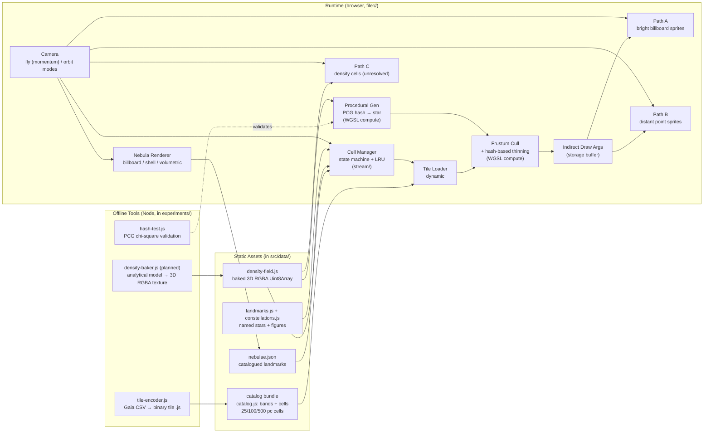

# Galaxy Fly-Through Engine — Development Plan

## 1. Overview

A WebGPU-based galaxy fly-through engine that renders the Milky Way at interactive frame rates, supports up to one million catalog stars and tens of millions of procedurally generated stars, and preserves a physically realistic density distribution at any visible object count.

The engine runs from `file://` with classic `<script>` tags — no build step, no module system, no internet dependency at runtime. All libraries are vendored locally. The same source files can be `require()`'d in Node for testing.

Two operating modes share the same render pipeline:

- **Hybrid mode** — Filtered real catalog stars (Gaia DR3 + Hipparcos + NGC) plus deterministic procedural fill in gaps and far regions.
- **Game mode** — Pure procedural, no catalog. The entire galaxy is generated from a seed and a density model.

In both modes the *density field* is the source of truth. Adjusting the visible object count from 10k to 1M does not change the apparent density — it changes only the sampling rate.

The core problem with raw star catalogs is that they are *not* a uniform sample of the Milky Way. Gaia DR3 contains ~1.46 billion sources, but completeness is essentially complete only between G=12 and G=17, and "at a distance of about 100 pc, the coolest stars become too faint for Gaia's survey limit" ([ESA Cosmos](https://www.cosmos.esa.int)). Useful sampling reaches ~3 kpc for bright tracers ([Vieira et al. 2023](https://www.research.unipd.it)). A naive catalog download therefore produces an over-dense blob centred on the Sun, with empty galaxy everywhere else. This plan solves that by treating the catalog as decoration (named/remarkable stars) and a baked analytical density field as the truth.

Elite Dangerous's "Stellar Forge" is the direct precedent: ~160,000 real Hipparcos stars seed a 1:1 scale Milky Way containing ~400 billion procedurally generated systems ([polygon.com](https://www.polygon.com), [ctrl500.com](https://ctrl500.com), [perthobservatory.com.au](https://perthobservatory.com.au)). The same hybrid pattern — real stars for landmarks, procedural fill for the rest, density model for the shape — is used here.

---

## 2. Architecture



Three stages:

1. **Offline tools** (Node scripts in `experiments/`) convert raw catalogs to binary tile files and bake the density field. They also validate the hash function. These run once per data refresh.
2. **Static assets** are vendored as local files. The catalog ships as **one** bundle file, `src/data/tiles/catalog.js`, which assigns a single object to `window.__galaxy_catalog` (cells as base64 `StarPacked` payloads). One injection per catalog instead of one per cell: 2045 cells would otherwise be 2045 script tags. It loads via classic `<script>` injection under `file://` without fetch.
3. **Runtime** is the browser page. A compute pass per frame generates procedural stars, culls, and produces an indirect draw buffer. The render pass draws three paths (bright, distant, density) plus nebulae.

---

## 3. Coordinate System & Precision

Right-handed Galactic Cartesian coordinates, Sun at origin:

```
X: toward Galactic longitude 0° (galactic centre direction)
Y: toward Galactic longitude 90°
Z: toward the Galactic north pole
unit: parsec
```

CPU simulation uses `f64`. The GPU receives **camera-relative** `f32` coordinates, not absolute Galactic coordinates: the shader subtracts a `f32` `camera.position` uniform from each star. Measured in `experiments/precision-test.js`, that is good to 0.005 pc at 100 kpc — far below one screen pixel — so split-double was dropped rather than carried as dead code (`src/math/split-double.js` is gone). At kpc distances, raw `f32` precision collapses (about 7 decimal digits, so at 10 kpc the precision is ~1 m — fine — but at 100 kpc it's ~10 m, and fly-through jitter becomes visible).

```text
starRelative = starPosition - cameraPosition
starRelativeHigh = floor(starRelative / scale) * scale
starRelativeLow  = starRelative - starRelativeHigh
```

The vertex shader reconstructs the precise position from high+low. The camera moves through the galaxy; the GPU always renders near-zero coordinates. This pattern is standard for planetary-scale rendering and avoids needing `f64` on the GPU (which WebGPU does not support in vertex shaders anyway).

Distance and magnitude conversions use the standard relations:

```
distance_pc = 1000 / parallax_mas
absolute_mag = apparent_mag - 5 * log10(distance_pc) + 5
```

---

## 4. Milky Way Density Model

The accepted model for stellar mass distribution combines four components. The full model is evaluated analytically in `experiments/density-baker.js` (planned for Path C; until then `src/math/density.js` is evaluated directly and `experiments/visualize-data.js` renders it) and later baked into a 3D RGBA texture sampled at runtime.

### Thin disc

```
ρ_thin(R, z) = A_thin · exp(-R / L_thin) · sech²(z / (2 · H_thin))
```

with `L_thin = 2.6 kpc`, `H_thin = 300 pc` ([NED/IPAC](https://ned.ipac.caltech.edu), [Imig 2025](https://iopscience.iop.org)). `sech²` is used instead of a pure exponential for the vertical profile because it matches observation better near the midplane.

### Thick disc

```
ρ_thick(R, z) = A_thick · exp(-R / L_thick) · exp(-|z| / H_thick)
```

with `L_thick = 3.5 kpc`, `H_thick = 900 pc`, and `A_thick / A_thin ≈ 0.12` ([Sysoliatina 2022](https://www.aanda.org)).

### Bulge / bar

Triaxial softened ellipsoid, following the Plummer-like form:

```
ρ_bulge(r_e) = A_bulge · (1 + (r_e / r_0)²)^(-5/2)
r_e = √(x² / a² + y² / b² + z² / c²)
```

with `a = 1.5 kpc, b = 0.5 kpc, c = 0.4 kpc`, oriented 25° from the Sun–centre line ([Portail 2016](https://academic.oup.com)).

### Stellar halo

Power law:

```
ρ_halo(r) = A_halo · (r / a_h)^(-3.5)    for r > a_h
```

with `a_h = 1 kpc` and `A_halo / A_thin ≈ 0.001` — low density but extends to 100+ kpc.

### Spiral arm modulation

A multiplicative perturbation on the disc components, *not* added as new density:

```
ρ_arms(R, φ) = 1 + A · cos(m · φ + k · ln(R / R_s) + φ₀)
```

with `m = 2` (two-armed pattern), `A ≈ 0.2`, `k = tan(i)` where `i ≈ 12°` is the pitch angle, `R_s = 3 kpc` reference radius ([Khrapov 2021](https://www.mdpi.com)). Used as a probability multiplier on the disc density, not as a separate component. This keeps the model stable and controllable.

### Combined

```
ρ_total = (ρ_thin + ρ_thick) · ρ_arms + ρ_bulge + ρ_halo
```

### Truncation

The profiles above are unbounded, which is fine for a picture and useless for a sampler: the Plummer bulge keeps a visible tail out to any radius and the exponential disc never reaches zero. The field is therefore truncated once, in the model itself, and every consumer sees the same cut:

```
disc:   R <= 25 kpc, |z| <= 3 kpc
bulge:  s = r_e / r0 <= 6        (Plummer radii, r0 = 1 kpc)
halo:   r <= 100 kpc             (part of the distribution, not a cut)
```

`density.js` applies these cuts inside `rhoThin` / `rhoThick` / `rhoBulge`, `sampling.js` draws each component inside the same bounds, and the WGSL mirror carries the same constants. Without this the sampler and the renderer disagree about the far field — the sampler truncates, the field does not — and every derived quantity that weights by density (nebula placement, `dominantComponent`, thinning) inherits the mismatch. Truncation also makes each component's contribution a finite number: `sampling.js` reports the truncated delivery fractions so the component shares in the tests have a closed form.

### RGBA texture packing

Baked into a 64×64×32 RGBA8 texture (about 128 KB):

```
R: total stellar density (normalised)
G: young-star density (for blue star placement)
B: dust density (for nebula placement)
A: nebula probability multiplier
```

The analytical form is also evaluated directly in WGSL when needed for cells beyond the texture bounds, so the model is exact everywhere the camera can reach.

---

## 5. Catalog Pipeline

### Source catalogs

| Source | Role | Approx. count after filter | Notes |
|---|---|---|---|
| Hipparcos / Tycho-2 | Named/remarkable stars | ~100k | All-sky, well-measured, includes bright stars Gaia saturates on |
| Gaia DR3 (filtered subset) | Real nearby stars with proper motion | ~200k–1M | Cut to `G < 12` and `parallax_over_error > 5` |
| NGC / Sharpless / Messier | Named clusters & nebulae | ~1k | Catalog of remarkable objects for landmarks |
| TRILEGAL mock catalogue | Calibration only | not shipped | Would validate the density model against a mock catalogue; not used yet |

### Offline tool: `experiments/tile-encoder.js`

Reads Gaia CSV (or FITS via a vendored parser), applies the magnitude and quality cuts, converts RA/dec/parallax to galactic XYZ, and writes one bundle:

```js
// src/data/tiles/catalog.js — one script tag for the whole catalog
window.__galaxy_catalog = {
        version: 1, encoding: 'base64', recordBytes: 16,
        bands: { near: { cellSize: 0.025, streamRadiusKpc: 0.5 }, /* medium, far */ },
        cells: [{ b: 0, c: [i, j, k], n: 42, d: 'base64 StarPacked payload' }],
};
if (typeof module !== 'undefined') module.exports = window.__galaxy_catalog;
```

The dual assignment lets the same file load via `<script>` in the browser and via `require()` in Node tests. Base64 costs ~33% over raw bytes and is invisible next to the HTTP/gzip reality; the alternative (raw `Uint8Array` literals) triples file size and parse time.

### Tile layout

Three LOD bands, fixed cubic cells per band:

```
near region (R < 200 pc):    25 pc cells,  resident within 0.5 kpc of the camera
medium region (R < 2 kpc):  100 pc cells,  resident within 2.5 kpc
far region (R > 2 kpc):     500 pc cells,  resident within 12 kpc
```

The three radii are properties of the data, not of the loader: the encoder writes them into the bundle's band table and `cell-manager.js` reads them from there. Later, replace with a sparse octree; fixed cells are used because the code is simpler and the lookup is `O(1)`.

### Packed star record

Each star in a tile is a 16-byte record:

```
struct StarPacked {        // 16 bytes
        float positionHighX, positionHighY, positionHighZ;  // 12 bytes
        uint32_t packed;                                    // 4 bytes
}
```

Where `packed` encodes:
- bits 0–7: colour index (256-entry lookup texture)
- bits 8–15: apparent magnitude (0–255 mapping to 0–20 mag)
- bits 16–23: flags (binary, variable, nebula-associated, landmark)
- bits 24–31: low-precision position offset (sub-cell jitter)

The low-precision position component plus the position-high gives enough precision for visual purposes. Absolute magnitude, temperature, and proper motion are reconstructed from the colour index via lookup textures — they do not need to be stored per star.

This packs 1 million stars into 16 MB. Five million into 80 MB. Twenty million into 320 MB — but most of those will be procedural and never stored on disk at all (see §7).

### Tile metadata

A cell needs no stored bounds: band cell size plus integer cell index is the box, which is why the payload is pure records. Per-cell metadata is limited to what the residency policy actually consumes:

```
{ b: band, c: [i, j, k], n: starCount, d: base64(payload) }
```

Magnitude statistics per cell are deliberately absent — the renderer derives brightness per star on the GPU from the packed record, and residency is decided by distance, not by magnitude.

---

## 6. Filtering & Priority

The bias problem is solved by *not* removing stars wholesale. Instead, every catalog star receives a priority score and the renderer thins by priority using a stable hash, so popping is impossible.

### Per-star priority score

```
priority =
    2.0 * brightnessScore       // apparent magnitude, brighter = higher
  + 1.0 * qualityScore         // parallax_over_error, well-measured = higher
  + 0.4 * landmarkScore        // named / in NGC / has planets
  + 0.2 * randomScore          // hash(starId) → [0,1], prevents banding
```

Landmarks (very bright, named, in NGC, has planets, in constellation lines) get a strong multiplier so they are never thinned away.

### Stable hash thinning

For each candidate star, compute a per-frame visibility probability:

```
p = clamp(D_target / D_local, 0, 1)
```

Where `D_local` is the local visible-star density (estimated from the cell and visible neighbours) and `D_target` is the configured target density (a runtime budget knob). The star is kept if:

```
hash(starId, tileId, lodLevel) < p
```

Because the hash is deterministic, the same star is always kept or always removed at the same LOD level. No flickering between frames.

### Screen-space thinning (GPU pass)

For each visible tile, a compute shader projects candidate stars to screen space, divides the screen into 2–4 pixel cells, and keeps the highest-priority star per cell. Lower-priority stars in the same cell are dropped. Additional stars in a cell are allowed if their brightness differs substantially from the kept star.

This is essentially the algorithm used by Stellarium and similar planetarium software for crowded-field rendering, and it is cheap to run on a compute shader.

---

## 7. Procedural Generation

Procedural stars fill the gaps left by the catalog and populate regions beyond catalog completeness. The same pipeline powers **game mode** (no catalog at all) — the catalog is simply another procedural source feeding the same compute shader.

### Stable hash

Every procedural star is identified by a 64-bit key:

```
key = hash64(galaxySeed, cellX, cellY, cellZ, slot, populationLayer)
```

The hash is **PCG hash** (Permuted Congruential Generator), recommended by Nathan Reed for GPU rendering ([reedbeta.com](https://www.reedbeta.com)). A fallback Wang hash is available for older GPUs. Both are stateless and parallel-friendly — perfect for WebGPU compute shaders with thousands of threads.

This means star `(seed=42, cell=(15,-3,2), slot=7)` is *always* the same star — same position, same colour, same magnitude, same proper motion. Move the camera, restart the page, switch machines: it does not matter. The galaxy is fully reproducible.

### Cell generation

For each spatial cell around the camera, the compute shader:

1. Evaluates the galaxy density at the cell centre (texture lookup or analytical).
2. Computes expected star count `λ = ρ(cell) · V_cell · luminosity_bias`.
3. Samples the actual count: `count = floor(λ) + (hash01(seed) < fract(λ))`.
4. For each slot `0..count-1`, hashes `(seed, cellId, slot)` and generates the star.
5. Each star has one owning cell — boundaries are handled by assigning the slot a strict-inequality cell test, so no star is ever generated twice.

### Star properties (per slot)

Each slot hash produces:

- Sub-cell position (stratified jitter, no grid alignment).
- Apparent magnitude — sampled from a Salpeter initial mass function, converted to absolute magnitude, then apparent magnitude from distance.
- Colour (B-V) — sampled from a colour-magnitude diagram appropriate to the local population (disc vs. bulge vs. halo).
- Proper motion — small random vector biased toward local galactic rotation.
- Variability flag — ~5% of stars marked as variable with phase and amplitude from hash.

### Magnitude-band completeness

A critical refinement over a single completeness function: the procedural generator tracks catalog completeness *per magnitude band*, because catalogs are often complete for bright stars but incomplete for faint ones at the same distance.

```
bands: 0–4 mag, 4–8 mag, 8–12 mag, 12–16 mag, 16+ mag
```

For each band, the cell knows `N_real_effective(band)` and `N_expected(band)`. The procedural generator produces only:

```
N_synthetic(band) = max(0, N_expected(band) - N_real_effective(band))
```

This prevents synthetic stars from over-populating regions where the catalog is already complete, and ensures they fill the gaps where it is not. In game mode, `N_real_effective(band) = 0` for all bands.

### Two modes share the pipeline

| Mode | Catalog used | Procedural used | Use case |
|---|---|---|---|
| Hybrid | Yes (filtered Gaia + Hipparcos + NGC) | Yes (gap-fill by magnitude band) | Realistic — see actual Pleiades / Orion at correct positions |
| Game | No catalog | Yes (entire galaxy) | Pure procedural exploration, fast startup, no asset download |

The renderer does not know which mode produced a given star. The compute shader's output buffer is the same shape in both modes.

### Density-preserving count scaling

The user's hard requirement: total object count must be adjustable (e.g. down to 10k) without distorting the density distribution. The strategy:

1. The density field defines relative density everywhere. It is the truth.
2. The target star count `T` is a runtime budget (10k, 100k, 1M).
3. A global scaling factor `s = T / Λ_total` (where `Λ_total` is the integral of the density field) multiplies every cell's expected count.
4. At low budgets, individual cells may produce zero stars; the *spatial distribution* remains correct because the rejection sampler still preserves the relative probability.

Result: at 10k stars the galaxy looks like a sparse but correctly-shaped galaxy. At 1M stars it looks like a dense, correctly-shaped galaxy. The user can trade visual richness for frame rate without corrupting structure.

---

## 8. WebGPU Rendering

Three render paths are used, chosen by LOD. A single frame may use all three simultaneously for different regions.

### Path A: bright and nearby stars (billboard sprites)

For stars closer than ~500 pc and brighter than ~6 apparent magnitude. Camera-facing quads sized by magnitude and distance. Fragment shader does soft radial falloff, glow, and optional diffraction spikes for the brightest stars.

Vertex shader input:
```
struct StarPacked { positionHigh: vec3<f32>, positionLow: vec3<f32>, packed: u32 }
```

Reconstruct camera-relative position from high+low. Project to clip space. Expand to a quad of size `f(magnitude, distance)`.

### Path B: distant individual stars (point sprites)

For stars beyond 500 pc or fainter than 6 mag. Plain point sprites, mostly unlabelled. Very cheap — one vertex per star, no expansion.

### Path C: unresolved density cells

For regions beyond ~5 kpc where individual stars occupy less than a pixel. The compute shader writes density-cell records instead of star records:

```
struct DensityCell {
        position: vec3<f32>,
        density: f32,         // integrated star density × volume
        avgColor: u32,        // weighted average colour
}
```

The renderer draws these as additive screen-space quads tinted by colour and density. This is what makes the galactic bulge and spiral arms glow correctly when far away, without spending GPU time on stars that would render as sub-pixel dots.

### Indirect draw + GPU culling

A single compute pass per frame:

1. Reads candidate stars from the catalog tile buffer and the procedural generation buffer.
2. Transforms to camera-relative coordinates.
3. Tests frustum, magnitude, distance LOD.
4. Applies stable hash thinning (§6).
5. Appends visible indices to a storage buffer.
6. Increments an indirect draw count.

```
@group(0) @binding(0) starStorage
@group(0) @binding(1) cellStorage
@group(0) @binding(2) visibleIndexStorage
@group(0) @binding(3) indirectArgsStorage
@group(0) @binding(4) cameraUniforms
@group(0) @binding(5) densityTexture
@group(0) @binding(6) colorLUT          // lookup texture for colour/mag → RGB
```

The render pass calls `drawIndirect` on the indirect args buffer. The CPU never reads the visible-star list. No readback, no per-frame allocation, no GC pressure.

### Memory layout (packed)

One `StarPacked` is 16 bytes. A draw budget of 1M stars means 16 MB of star data resident on the GPU. The visible index buffer is `u32` per star, so 4 MB max. Indirect args are a handful of `u32` values. Total GPU memory budget is well under 50 MB for stars alone — the rest goes to nebulae and the density texture.

---

## 9. Streaming & Cell State Machine

The galaxy is not generated at startup. Space is divided into deterministic cells, and cells around the camera are streamed in/out based on a memory budget.

### Residency

`src/stream/cell-manager.js` keeps one residency set, recomputed when the camera has moved more than half a fine cell (12.5 pc) or 0.25 s have passed, whichever comes first:

1. collect every cell whose box lies within its band's streaming radius of the camera,
2. order candidates nearest-first by squared distance to the cell box, ties broken by cell index,
3. take cells in that order while the running star count stays inside `budgetStars` (default 250,000).

Cells outside every band radius are dropped, so a camera that leaves the catalog volume empties the set and the renderer stops drawing catalog stars. Decoded payloads live in an LRU cache (4096 cells by default), and the GPU buffer is re-uploaded only when the resident set actually changed.

A residency set plus an LRU cache replaces a per-cell state machine: nothing can run off the main thread under `file://` anyway, and a set is far easier to reason about than six states per cell.

### Streaming radii

```
near:    200 pc region      resident within 0.5 kpc      catalog, full detail
medium:  2 kpc region       resident within 2.5 kpc      catalog
far:     10 kpc region      resident within 12 kpc       catalog
```

The radii are data: the encoder writes them into the bundle's band table and the manager reads them from there, so retuning streaming is an asset change, not a code change. Beyond the far radius the procedural field (Path C) covers the sky; individual catalog stars are not streamed that far.

### Memory budget

The catalog budget is denominated in stars, not bytes, because stars are what the visual quality is made of: `budgetStars` (default 250,000) × 16 B = 4 MB of GPU buffer. Byte-denominated budgets return with Path C, where density cells have wildly different costs per visible pixel.

### file://-compatible catalog loading

The catalog is loaded once, via dynamic `<script>` tag injection, not `fetch()`:

```
1. create <script> element with src = data/tiles/catalog.js
2. on script.onload: take window.__galaxy_catalog, delete the global
3. remove <script> element from DOM
4. prepareBundle(): decode the band table, index every cell, build the band radius table
```

This works under `file://` in all major browsers because classic script loading is permitted, while `fetch()` is blocked by CORS for local files in Chrome and Edge. A single script for the whole catalog keeps the DOM mutation to one element; per-cell scripts would be 2045 tags and 2045 parse events for a catalog this size.

---

## 10. Nebulae

Nebulae are independent of the star population. They render in their own pass and may be billboards, shells, or volumetric.

### Three tiers

| Tier | Technique | Use case | Cost |
|---|---|---|---|
| Billboard | Camera-facing quad with pre-rendered texture | Most catalogued nebulae (Orion, Lagoon, Eagle) | Cheap |
| Shell | Ellipsoid or irregular shell with 3D noise | Mid-distance nebulae, dust clouds | Medium |
| Volumetric | Raymarch through 3D density texture | Hero nebulae the camera enters | Expensive |

### Catalogued nebulae (hybrid mode)

A short list of named nebulae is shipped as `nebulae.json`:

```
center: vec3 (galactic XYZ)
orientation: quat
size: float (bounding radius)
shape: enum (billboard | shell | volumetric)
color: vec3 (peak emission)
density: float
opacity: float
texture: string (filename) or seed (for procedural)
```

Always rendered when in view.

### Procedural nebulae (both modes)

The density field's `B` channel (dust density) and `A` channel (nebula probability) drive procedural placement. The compute shader samples these channels in spiral arm regions and emits `DensityCell` records with `nebula_probability > threshold` — these become procedural nebula instances.

Each procedural nebula is hash-seeded:

- Centre position (in arm, offset from midplane)
- Three-octave 3D noise field for internal density variation
- Colour tint based on local stellar population (red in HII regions, blue in reflection)

### Volumetric raymarch

For hero nebulae (the few the camera can enter), the renderer raymarches through the nebula's bounding volume:

1. Marches from near to far plane in 32–64 steps.
2. At each step, samples a 3D noise texture (animated FBM) for density.
3. Accumulates emission (coloured by nebula tint × local density) with beer-lambert absorption.
4. Composites over the star background.

Following [Maxime Heckel's volumetric cloudscapes](https://blog.maximeheckel.com) and NVIDIA GPU Gems 3 Ch. 30. The pass is capped: render at half resolution and upscale; skip entirely when the camera is moving fast.

---

## 11. File Structure

Project layout, following AGENTS.md conventions (file:// friendly, no build, vendored libs):

```
galaxy-flythrough/
├── AGENTS.md                           # style + runtime rules
├── plan.md                             # this file
├── findings-pitfalls-skills.md         # LLM notes/pitfalls
├── worklog.md                          # what each task actually did
├── archive/                            # superseded plans
├── experiments/                        # Node scripts, not loaded by the page
│   ├── logs/                           # validation results (one JSON per test)
│   ├── tile-encoder.js                 # Gaia CSV or mock → src/data/tiles/catalog.js
│   ├── tile-stream-test.js             # encoder → loader → cell manager end to end
│   ├── tile-encoder-smoke-test.js      # encoder → bundle → loader round trip
│   ├── renderer-test.js                # star-sprites against a stub WebGPU device
│   ├── wgsl-validate.js                # WGSL mirror vs the JS model
│   ├── m1-smoke-test.js                # module wiring + index.html script order
│   ├── export-parity-test.js           # window.* API == module.exports API
│   ├── camera-test.js                  # camera model, dt independence, no allocations
│   ├── sampling-test.js                # sampler vs the analytical model
│   ├── density-distribution-test.js    # box sampler vs the model
│   ├── star-types-evolution-test.js    # population types vs the evolution model
│   ├── nebula-placement-test.js        # nebula types vs their environments
│   ├── visualize-data.js               # sample for scripts/viz-galaxy.py
│   ├── hash-quality-test.js            # PCG/Wang statistics
│   ├── precision-test.js               # f32 vs split-double at galactic distances
│   ├── packing-test.js                 # StarPacked round trip, memory budget
│   ├── filter-test.js                  # priority score / thinning behaviour
│   └── landmark-test.js                # landmark data, constellations, picking
└── src/                                # runtime, loaded by index.html
    ├── index.html                      # classic <script> tags only
    ├── style.css
    ├── core/
    │   ├── device.js                   # WebGPU device + clamp to adapter limits
    │   ├── camera.js                   # fly (momentum) + orbit modes, ly/s speeds
    │   ├── input.js                    # keyboard/mouse, wheel normalised to px
    │   ├── selection.js                # click picking against the landmarks
    │   └── loop.js                     # frame loop, dt clamp, stats
    ├── math/
    │   ├── hash.js                   # PCG/Wang (mirrors WGSL)
    │   ├── density.js                # analytical density field + truncations
    │   ├── sampling.js               # exact single-pass sampler
    │   ├── star-record.js            # StarPacked layout + colour LUT
    │   ├── star-types.js             # IMF, ages, evolution state, class
    │   ├── nebula.js                 # nebula probability + placement
    │   └── coords.js                 # RA/Dec/parallax → galactic XYZ, world → screen
    ├── stream/
    │   ├── tile-loader.js            # bundle injection, decode, manifest
    │   └── cell-manager.js           # residency set, nearest-first, LRU
    ├── render/
    │   ├── shaders.js                # all WGSL as JS strings
    │   ├── star-sprites.js           # star draw path (procedural + landmarks + catalog)
    │   └── label-layer.js            # 2D overlay canvas: labels + constellation lines
    ├── data/
    │   ├── gaia-subset.csv           # source catalog (5,000 rows)
    │   ├── landmarks.js              # named stars, galactic XYZ baked at load
    │   ├── constellations.js         # figures as pairs of landmark names
    │   └── tiles/catalog.js          # generated bundle (window.__galaxy_catalog)
    └── main.js                       # boot, wires everything
```

Milestones 2+ add the remaining render paths (`density-cell.js`, nebula passes), the baked density field, and the compute pipeline (`cull.wgsl`, `procedural-gen.wgsl`); `shaders.js` already carries those shader sources so they are validated long before they are wired.
### Runtime conventions (see AGENTS.md for full rules)

- **Single tab indentation, LF line endings.**
- **Classic `<script>` tags only** — no ES modules, no bundler, no `import`/`export`.
- **Each file guards `module.exports`** so the same source can be `require()`'d in Node tests.
- **No allocations in the hot path** — frame loop reuses preallocated typed arrays and scratch objects.
- **No internet links** — all libraries vendored in `src/vendor/`.
- **One API object per file, exposed to both environments.** `module.exports` and `window.X` must be the *same* object; never two hand-maintained lists. They drifted apart once and shipped a boot-time `TypeError` (`StarRecord.writeRecord` existed only under Node). `m1-smoke-test.js` and `export-parity-test.js` enforce this.
- **WGSL lives in `src/render/shaders.js` as JS template strings**, not as `.wgsl` files and not as `text/x-wgsl` blocks in `index.html`. Three reasons: the same source can be `require()`'d and diffed in Node by `wgsl-validate.js`; the duplicated copy in `index.html` had already drifted from the `.wgsl` files it was supposed to mirror; and strings need no `getElementById` step at boot. No `fetch()`, so `file://` still works.

### Boot sequence (`main.js`)

```
1. parse URL params (stars, catalog, exposure, seed)
2. init WebGPU device, configure the canvas context
3. create the star renderer (shader module, pipeline, storage buffer, uniform)
4. generate the procedural field on the CPU into the staging buffer (once)
5. inject data/tiles/catalog.js, build the manifest, attach the catalog
6. init the camera at Sol (0, 0, 0.005 kpc) and the frame loop:
     a. update the camera from input (fly integration or orbit placement, by mode)
     b. cell manager: recompute residency if the camera moved, re-upload if changed
     c. render pass: one instanced draw over [procedural][resident catalog]
     d. present
```

The compute pass (procedural gen on the GPU, cull, indirect args) replaces steps (b)+(c) in the milestone-4 version; the CPU path exists so the flight prototype does not depend on compute support.

---

## 12. Initial Limits

Starting configuration, all runtime-tunable:

```
real catalog stars (resident):       1,000,000
synthetic resident stars:            5,000,000
synthetic generated per frame:        up to 20,000,000+
nearby full-detail radius:           100 pc
catalog streaming radius:            2 kpc
density-cell-only region:            beyond 5 kpc
star sprite size:                    1–6 pixels
GPU culling:                         compute shader
draw submission:                      drawIndirect
target frame rate:                    60 fps (30 fps minimum on integrated)
```

The fundamental scalability rule:

```
millions of packed records in storage
hundreds of thousands or millions actually drawn
billions represented statistically via density cells
```

That separation is what makes the project scalable. A 1 M star hybrid scene and a 100 star scene use the same renderer — only the budgets differ.

---

## 13. Implementation Order

The order matters. Build the renderer and streaming first; procedural generation is added as an additional data source, not a separate engine.

1. **Camera-relative coordinate system.** `split-double.js`, `camera.js`, `coord.js`. Validate precision with `experiments/precision-test.js`.
2. **Packed GPU star buffer.** `StarPacked` struct, colour LUT, staging buffer upload.
3. **Basic point-sprite renderer (Path B).** One vertex per star, simple fragment shader. Hard-coded 100k test stars in a cube.
4. **Spatial tile loading.** `tile-loader.js`, `cell-manager.js`, dynamic `<script>` injection. Load real catalog tiles.
5. **GPU frustum culling.** `cull.wgsl` compute shader, `drawIndirect` render path.
6. **Stable deterministic thinning.** Per-star priority score, hash-based visibility. `experiments/hash-test.js` validates PCG quality.
7. **Real catalog filtering.** `tile-encoder.js` applies magnitude cut, parallax quality cut, magnitude-band completeness tracking.
8. **Synthetic density generation.** `procedural-gen.wgsl` compute shader, density texture lookup, PCG hash → star properties.
9. **LOD density rendering (Path C).** `density-cell.wgsl`, additive screen-space quads.
10. **Nebula rendering.** Billboard tier first, then shell, then volumetric for hero nebulae.

Do not begin with procedural galaxy generation. First make the catalog renderer fast, stable, and visually controllable. Once the renderer and streaming system work, the synthetic population plugs in as another data source feeding the same compute-cull-render pipeline.

---

## 14. Milestones

### Milestone 1 — WebGPU flight prototype
- Free-fly camera, camera-relative coordinates, split-double precision
- 100k hard-coded test stars
- Point sprites (Path B only)
- FPS and GPU timing overlay

### Milestone 2 — One-million-star catalog
- `tile-encoder.js` produces binary tiles from Gaia CSV
- CPU tile streaming via dynamic `<script>` injection
- GPU frustum culling, `drawIndirect`
- 1M real stars, all three LOD bands

### Milestone 3 — Density-aware filtering
- Per-star priority score
- Stable hash thinning
- Screen-space occupancy grid (compute shader)
- Brightness-priority retention
- Smooth LOD transitions, no popping

### Milestone 4 — Procedural filling
- PCG hash in WGSL
- Density texture lookup
- Disc, bulge, thick-disc, halo model
- Magnitude-band gap filling
- Hybrid mode operational

### Milestone 5 — Game mode & large-scale galaxy
- Toggle hybrid ↔ pure-procedural
- Spiral arm modulation
- Path C density-cell rendering
- High/low coordinate precision everywhere
- Count scaling: 10k ↔ 1M with density preserved

### Milestone 6 — Nebulae
- `nebulae.json` format, catalogued landmarks
- Billboard renderer
- Dust absorption
- Shell noise
- Volumetric raymarcher for hero nebulae

### Milestone 7 — Optimisation
- Indirect draws, GPU-generated visible lists
- Worker-based streaming (OffscreenCanvas, optional)
- Compressed binary tiles
- Memory budgets enforced
- Profiling on integrated graphics

---

## 14a. Deferred Tuning Phase

After Milestones 1–7 ship a working renderer, the following tuning tasks refine correctness, performance, and visual quality. They are intentionally deferred because they depend on measurements from a running system and have known trade-offs that should be evaluated empirically rather than guessed.

The first three experiments in this phase have already been implemented as scripts in `experiments/` and have baseline measurements. The remaining items are speculative until the runtime exists.

### Tuning tasks (with implemented experiments)

| # | Task | Experiment script | Log | Status |
|---|---|---|---|---|
| T1 | Validate PCG hash quality (chi-square, serial correlation, spectral, period) | `experiments/hash-quality-test.js` | `logs/hash-quality.json` | Baseline measured. PCG passes all 4 tests. Wang passes 2/4 (used as fallback only). |
| T2 | Quantify f32 vs split-double precision at kpc distances | `experiments/precision-test.js` | `logs/precision-test.json` | Baseline measured. f32 max error at 100 kpc = 0.005 pc (well below star-size threshold). Split-double is unnecessary for star rendering. Use it only for camera-position offset computation if jitter appears. |
| T3 | Validate packed 16-byte StarPacked struct round-trip + memory budget | `experiments/packing-test.js` | `logs/packing-test.json` | Baseline measured. Round-trip fidelity: position max error 7e-7 kpc (f32 round), magnitude quantum 0.078 mag. 1M stars = 19.2 MB total GPU memory. 5M stars = 95.5 MB. 20M stars = 381.6 MB. |
| T4 | Validate per-star priority score + magnitude-band completeness + hash thinning determinism | `experiments/filter-test.js` | `logs/filter-test.json` | Baseline measured. Priority distribution: max bucket 5.2% (no banding). Hash thinning: deterministic, actual fraction 0.298 vs target 0.3 (within 1%). Screen-space thinning preserves highest-priority in 100% of cells. |
| T5 | Arm contrast in the sampled field | `experiments/sampling-test.js`, `experiments/density-distribution-test.js` | `logs/sampling.json`, `logs/density-distribution.json` | Done. The 1.25-vs-1.50 discrepancy was a bad reference (a fixed-kpc box discounts the arm term); the sampler reproduces `1 + A·cos(theta)` to within a few percent on 600k stars, and the R / z / phi histograms match the model. |
| T6 | Nebula type mixture | `experiments/nebula-placement-test.js` | `logs/nebula-placement.json` | Done. HII sits on the arm ridges, planetary nebulae dominate the inner galaxy, no nebula lands in the halo, and the type mix follows the gas/stellar probability split. Mixture weights remain tunable once nebulae render in-scene. |
| T7 | Catalog streaming: residency, hysteresis, nearest-first budget, decode cache | `experiments/tile-stream-test.js` | `logs/tile-stream.json` | Done. Encoder → loader → cell manager consistency, hysteresis at 12.5 pc, an empty sample outside the volume, and the tight-budget selection matching a brute-force nearest-first fill. |
| T8 | Renderer behaviour without a GPU | `experiments/renderer-test.js` | `logs/renderer.json` | Done. `star-sprites.js` runs against a stub device: buffer sizing, procedural upload once, catalog upload only on residency change, instance count, uniform packing and exposure clamping. |
| T9 | Browser/Node API drift | `experiments/export-parity-test.js` | `logs/export-parity.json` | Done, and it caught a real bug (`StarRecord.writeRecord` was missing from the browser export). Every module now exposes one object to both environments. |

### Speculative tuning (deferred until runtime exists)

- **Camera-position precision**: measured `precision-test.js` says f32 with camera-relative subtraction is good to 0.005 pc at 100 kpc; revisit only if jitter is ever seen beyond that.
- **Cell size optimisation**: currently 25 / 100 / 500 pc with 0.5 / 2.5 / 12 kpc streaming radii. Measure decode hit rate and re-upload cost at other splits once a browser profile exists.
- **Workgroup size**: `procedural-gen.wgsl` uses 8×8×1 (64 threads). Profile 8×8×1 vs 16×16×1 vs 32×1×1 on target GPUs once a runnable benchmark exists.
- **Indirect draw batching**: currently one `drawIndirect` per frame for all stars. Once nebulae and density cells are separate paths, evaluate merging into a single multi-draw-indirect call.
- **Tile compression**: 16-byte records may compress to ~10 bytes with delta encoding relative to cell centre. Defer until memory pressure appears in profiling.
- **Variable star animation**: ~5% of stars are flagged variable in `procedural-gen.wgsl`. Phase and amplitude are hash-derived. Tune amplitude distribution once animated rendering is visible.
- **Proper motion drift**: currently zero. Add small proper-motion vector per star once long-running sessions are tested.
- **LOD transition smoothness**: hash-based thinning prevents popping, but cross-LOD transitions may still show density steps. Add hysteresis once visible.
- **Bulge bar tilt**: currently fixed at 27°. May need to animate over cosmic time once a "time scrubber" UI is added (Milestone 6 stretch).

### Tuning methodology

1. Run the relevant experiment script to capture the baseline.
2. Change the constant in `src/math/*.js` — the source of truth.
3. Change the mirrored constant in `src/render/shaders.js` if the shader uses it.
4. Run `experiments/wgsl-validate.js`; it fails if the mirror no longer matches.
5. Re-run the experiment and confirm the metric improved.
6. Append the before/after to `findings-pitfalls-skills.md` with a dated entry.

The split between the JS model (testable in Node) and the WGSL mirror (what the GPU runs) is unavoidable; the validator is the contract that keeps them in sync, and it diffs constants, function names and structural markers rather than trusting the two files to be edited together.

---

## 15. Risks & Mitigations

| Risk | Likelihood | Impact | Mitigation |
|---|---|---|---|
| WebGPU not available on target browser | Medium | High | Detect at runtime; clear error message with browser support link |
| 1M stars drops below 60 fps on integrated GPUs | Medium | Medium | Budget slider; density field stays correct at any budget |
| Catalog asset too large for web delivery | Medium | Medium | The bundle is 165 KB for the 5,000-star subset; a full 1M-star catalog is ~16 MB raw, and base64 adds a third on top, so wide delivery goes through gzip/HTTP rather than `file://` |
| Procedural star positions show grid alignment | Low | Medium | Stratified jitter within each cell; verify with nearest-neighbour histogram |
| Nebula volumetric pass dominates frame time | Medium | High | Cap ray count; render at half resolution; skip when camera moves fast |
| PCG hash shows visible patterns at scale | Low | High | `experiments/hash-test.js` runs chi-square; switch hash if it fails |
| `file://` blocks dynamic `<script>` injection in some browsers | Low | High | Classic script injection is the one loading mechanism `file://` permits; the catalog is already a single base64 bundle, so there is nothing further to fall back to |
| Catalog download (Gaia DR3) is multi-GB | High | Medium | Run `tile-encoder.js` once; ship only the filtered tiles (~50–200 MB) |
| Density model looks right near Sun but wrong in bulge | Medium | Medium | Compare against a TRILEGAL mock catalogue; `experiments/density-distribution-test.js` already checks the sampler against the model |

---

## 16. Open Questions

- **Time scale for proper motion**: real-time is invisible. Either accelerate by 10^6× or expose a "time scrubber" UI.
- **Asset licensing**: Gaia DR3 is ESA CC-BY; Hipparcos is open; NGC references need verification before shipping.
- **Worker offload**: keep main-thread initially; add OffscreenCanvas worker in Milestone 7 only if profiling demands it. Workers complicate `file://` loading.
- **Save/load bookmarked positions**: defer to a stretch milestone; serialise camera position + seed to URL hash.

---

## 17. References

### Catalogs & completeness bias
- ESA Cosmos — *Gaia EDR3 Catalogue of Nearby Stars* — https://www.cosmos.esa.int
- dc.g-vo.org — *Gaia EDR3 completeness notes* — https://dc.g-vo.org
- Vieira et al. 2023 — *Vertical Structure of the Milky Way Disk with Gaia DR3* — https://www.research.unipd.it
- Bailer-Jones et al. — *Distances for 1.47 billion stars in Gaia DR3* — https://www2.mpia-hd.mpg.de
- Gaia Collaboration 2025 — *Gaia: Ten Years of Surveying the Milky Way* — https://arxiv.org

### Milky Way density model
- NED/IPAC — *Mass distribution in disk galaxies* — https://ned.ipac.caltech.edu
- Li 2016 — *Modelling mass distribution of the Milky Way galaxy* — https://arxiv.org
- Sysoliatina 2022 — *Towards a fully consistent Milky Way disk model* — https://www.aanda.org
- Portail 2016 — *Dynamical modelling of the galactic bulge and bar* — https://academic.oup.com
- Khrapov 2021 — *Modeling of Spiral Structure in a Multi-Component Milky Way* — https://www.mdpi.com
- Imig 2025 — *Density Structure and Integrated Properties of the Milky Way* — https://iopscience.iop.org

### Procedural galaxy generation (industry)
- Frontier Forums — *Are new systems procedurally generated?* — https://forums.frontier.co.uk
- ctrl500 — *Our Entire Galaxy Re-created In Elite: Dangerous* — https://ctrl500.com
- Polygon — *Elite Dangerous: Odyssey* (400B star systems) — https://www.polygon.com
- Perth Observatory — *Elite Dangerous / Stellar Forge* — https://perthobservatory.com.au
- SpaceEngine — *Procedural galaxies* — https://spaceengine.org
- Martin Devans — *Procedural Generation For Dummies: Galaxy Generation* — https://martindevans.me

### Synthetic population models
- Gao 2013 — *Detailed comparison of Milky Way models based on stellar counts* — https://www.aanda.org
- Besançon Galaxy Model — https://perso.astrophy.u-bordeaux.fr
- Pasetto 2018 — *GalMod: the last frontier of Galaxy population synthesis models* — https://ui.adsabs.harvard.edu

### WebGPU & GPU rendering
- Kitware — *Achieving Interactivity with a Point Cloud of 2 Billion* — https://www.kitware.com
- Magnopus — *How we render extremely large point clouds* — https://www.magnopus.com
- Arenbro 2026 — *An Evaluation of WebGPU Point Cloud Rendering* — https://www.diva-portal.org
- TU Wien — *Rendering of Point Clouds via WebGPU* — https://www.cg.tuwien.ac.at
- Three.js Roadmap — *Interactive Galaxy with WebGPU Compute Shaders* — https://threejsroadmap.com
- Inria HAL 2026 — *Massive Procedural Rendering of Stars on the GPU* — https://inria.hal.science

### Hash functions
- Nathan Reed — *Hash Functions for GPU Rendering* — https://www.reedbeta.com
- PCG Wiki — *Hash Function* — https://pcg.wikidot.com
- pcg-random.org — *Developing a seed_seq Alternative* — https://www.pcg-random.org

### Nebula & volumetric rendering
- Maxime Heckel — *Real-time dreamy Cloudscapes with Volumetric rendering* — https://blog.maximeheckel.com
- NVIDIA GPU Gems 3 Ch. 30 — *Real-Time Simulation and Rendering of 3D Fluids* — https://developer.nvidia.com
- Casey Primozic — *Volumetric Rendering Experiment* — https://cprimozic.net

---

## 18. Upcoming: 0.1.1 — 0.1.5

`archive/0.1.1-draft.md` is the original one-line brief and `archive/0.1.1-plan.md`
the first expansion of it; both are superseded by this section, which is the spec
a fork should implement from. `plan-0.1.1-tasks.md` is the per-file checklist.

### 0.1.1 — Camera modes (implemented)

**Brief:** fly / orbit the galactic centre / orbit the selected object, wheel ×2 speed
or distance, 8 ly/s default, Shift ×100, Ctrl ×0.1, `H` home, `C` cycles modes.

#### Modes and the one angle pair

```
MODE_FLY = 0 → MODE_ORBIT_GC = 1 → MODE_ORBIT_OBJECT = 2 → MODE_FLY   (KeyC)
```

There is **one** `yaw`/`pitch` pair and it always means "the direction the camera
looks". Fly mode integrates position with momentum; orbit mode derives it:

```
forward  = (cos yaw · cos pitch, sin yaw · cos pitch, sin pitch)
position = target − orbitDistance · forward          (orbit modes, every frame)
```

Consequences, and why the first plan's separate `orbitYaw/orbitPitch` was dropped:

- Mouse look is the same code in both modes. In orbit it moves the camera on the
  sphere while the target stays centred, and it lands on the standard "grab the
  world" convention (drag right → camera swings left, the scene turns with the
  cursor; drag down → camera rises) without a sign table.
- Entering orbit snaps the *angles*, not the position: `orbitDistance = |P − T|`,
  `yaw = atan2(Ty−Py, Tx−Px)`, `pitch = asin((Tz−Pz)/d)`, then `position = T − d·forward`
  reproduces P exactly. Leaving orbit changes nothing — position, yaw and pitch
  continue, velocity is already zero. Switching is continuous both ways.
- No momentum in orbit: `velocity` is zeroed on entry and never integrated, so the
  camera cannot drift off the sphere.

Targets. `ORBIT_GC` circles `DensityLib.GALACTIC_CENTRE` (read from the model, not a
second copy of 8.178). `ORBIT_OBJECT` circles `objectTarget`, a `Float64Array(3)` set by
`setOrbitTarget(x, y, z, name)` and defaulting to the Sun, so the mode is usable before
0.1.2 adds selection; a call while `ORBIT_OBJECT` is active re-snaps to the new target
from the current position (the camera turns, it does not teleport). Distance clamps to
`[ORBIT_DISTANCE_MIN = 0.0001 kpc, ORBIT_DISTANCE_MAX = 100 kpc]`; pitch keeps the fly clamp.

#### Controls

| Input | Fly | Orbit (both) |
|---|---|---|
| drag / pointer lock | look | move on the sphere (target stays centred) |
| scroll | speed ×2 per notch (up = faster) | distance ×2 per notch (up = closer) |
| W / S, ↑ / ↓ | forward / back | dolly: ×2^(∓ORBIT_DOLLY_RATE·dt) — halves or doubles per second |
| A / D, ← / → | strafe | circle left / right at ORBIT_TURN_RATE rad/s (D moves the camera right) |
| E / Q | up / down | rise over / dip under the target at ORBIT_TURN_RATE |
| Shift / Ctrl | ×100 / ×0.1 (both held: ×10) | ×4 / ×0.25 on the key rates (`ORBIT_KEY_BOOST`) — ×100 on an angular rate is 16 turns a second |
| C | next mode | next mode |
| H | teleport to `START_POSITION`, yaw = pitch = 0, velocity 0; speed multiplier kept | `ORBIT_OBJECT` around the Sun at `HOME_ORBIT_DISTANCE = 0.01 kpc`, viewing direction kept |
| R | full reset: home + speedMult 1 + object target back to the Sun | same |

Key semantics differ from mouse semantics on purpose: keys *move the camera* (D goes
right, E goes up, as in fly), the mouse *grabs the world*. Google Earth uses the same
split.

Ctrl is the brief's choice and carries one trap: **Ctrl+W closes the tab on Windows and
Linux and no page can prevent it.** Every mapped key calls `preventDefault()` so Ctrl+R
(reload) and Ctrl+H (history) are safe; for slow flight forward use Ctrl+↑. The help text
says so.

#### Wheel: whole notches, accumulated

`input.js` normalises `deltaMode` to pixels (`WHEEL_UNITS_PER_MODE = [1, 100/3, 100]`:
Chrome mice report 100 px per notch, Firefox 3 lines per notch) and the camera keeps a
persistent accumulator:

```
wheelAccum += input.wheelDelta;  input.wheelDelta = 0
notches     = trunc(wheelAccum / WHEEL_NOTCH_PX)        // WHEEL_NOTCH_PX = 100
wheelAccum -= notches · WHEEL_NOTCH_PX                   // remainder carries over
fly:   speedMult     = clamp(speedMult · 2^−notches, SPEED_MULT_MIN, SPEED_MULT_MAX)
orbit: orbitDistance = clamp(orbitDistance · 2^notches,  ORBIT_DISTANCE_MIN, ORBIT_DISTANCE_MAX)
```

Rounding per frame (`round(wheelDelta/100)`) would make trackpads inert: their 3–10 px
events round to zero and were then discarded. The clamps are `1/64` and `256` — powers
of two — because the multiplier walks a ×2 grid and must be able to return to exactly
×1; clamping at 0.02 would leave it on 0.02·2ⁿ forever.

#### Constants

```
LY_TO_KPC          = 0.000306601        1 ly = 0.306601 pc
BASE_SPEED_KPC_S   = 8 · LY_TO_KPC      = 0.00245281 kpc/s
SPEED_MULT_MIN/MAX = 1/64, 256          0.125 ly/s … 2048 ly/s; ×0.1 … ×100 on top
BOOST_FACTOR       = 100 (Shift)        SLOW_FACTOR = 0.1 (Ctrl)
WHEEL_NOTCH_PX     = 100
ORBIT_DISTANCE_MIN = 0.0001 kpc         ORBIT_DISTANCE_MAX = 100 kpc
ORBIT_TURN_RATE    = 1.0 rad/s          ORBIT_DOLLY_RATE = 1.0 octave/s
ORBIT_KEY_BOOST    = 4                  Shift ×4, Ctrl ×0.25 in orbit
HOME_ORBIT_DISTANCE= 0.01 kpc
START_POSITION     = (0, 0, 0.005)      SUN_POSITION = (0, 0, 0)
```

`getState(out)` adds `mode`, `modeName` (from the constant `MODE_NAMES` table, no
string building), `orbitTarget`, `orbitDistance`, `targetName`, `speedFactor` (the
Shift/Ctrl product last seen), `speedKpcPerSec` (includes the factor) and `speedLyPerSec`.
The overlay prints `camera <mode>`, speed in ly/s with the factor, and the orbit target
and distance when orbiting. Per-frame cost is unchanged: no allocation, the same
preallocated `viewProj` / `cameraPos` / basis arrays.

#### Input additions

`keys.slow` (`ControlLeft`/`ControlRight` — the DOM codes are `Control*`, not `Ctrl*`),
`actions.home` (`KeyH`), `actions.cameraMode` (`KeyC`). One-shot actions ignore
`e.repeat` so a held `C` does not cycle at the key-repeat rate; exposure keys accumulate
(`+= ±1`) so repeat is one more step and two repeats in one frame are two steps.

#### Tests (`experiments/camera-test.js`)

Units (8 ly/s in kpc), wheel notch ×2 in both directions, accumulation across frames and
remainder carry, clamps land on powers of two, boost ×100 / slow ×0.1 / both ×10, mode
cycle and action consumption, orbit entry keeps the position and aims at the target,
position stays on the sphere under random look input, wheel and W/S change distance,
A/D and E/Q turn at the documented rate and are dt-independent, distance clamps, the
default object target is the Sun, `setOrbitTarget` re-snaps, `H` in fly and in orbit,
`R` restores everything, orbit → fly is continuous with zero velocity, buffers are
never reallocated across mode switches.

### 0.1.2 — Landmarks & constellations (implemented)

**Goal:** 30–60 named stars with on-screen labels, `P` toggles constellation
lines, click selects the orbit target.

- Data: `src/data/landmarks.js` — one API object, entries `{ name, ra, dec,
  distPc, mag, colorIndex, constellation }` plus galactic XYZ and the absolute
  magnitude (`M = m − 5·log10(d_pc) + 5`) computed once at load through the
  RA/Dec/parallax → XYZ conversion in `src/math/coords.js`. That conversion
  moved there from the encoder so both datasets share one frame; Sirius and the
  galactic centre remain its self-tests in `tile-encoder.js`.
  `src/data/constellations.js` — 15 figures as pairs of landmark names,
  resolved to landmark indices at load; an unknown name throws at load.
- Rendering the stars themselves: Gaia saturates on the brightest stars, so the
  landmarks are **not** assumed to be in the catalog subset. They are written
  as a fixed extra block between the procedural block and the catalog region —
  `[procedural][landmarks][catalog]` — with `FLAG_VISIBLE | FLAG_LANDMARK`
  (already reserved in `StarRecord`), so the drawn instance range stays
  contiguous and they render as sprites regardless of the catalog.
- Labels and lines: a 2D canvas over the WebGPU canvas (`#labels`, pointer
  events pass through), drawn in CSS pixels under a devicePixelRatio transform.
  Drawn **every frame**, not at the 4 Hz overlay cadence — a label that updates
  at 4 Hz visibly trails its star while the camera moves. ~60 projections and
  ~60 `fillText` calls with constant strings allocate nothing. Cull labels
  behind the camera (`clip.w <= 0`) and skip a line when either end is behind;
  lines are screen-space segments, adequate at these separations. Lines default
  to on; `P` toggles.
- Selection: `src/core/selection.js` — `pick(screenX, screenY)` projects the
  landmarks with the camera's `viewProj` and returns the nearest within
  `PICK_RADIUS_PX = 20`; a click without drag (mouse-up within 4 px of
  mouse-down) picks. Under pointer lock the client coordinates are frozen, so
  the pick point is the canvas centre — where the camera aims. The result calls
  `camera.setOrbitTarget(x, y, z, name)` and, in fly mode, the overlay shows
  the name. `R` clears the selection along with the orbit target.
- Input: `actions.pick` with the click position (`pickX` / `pickY`, canvas
  relative), `actions.constellations` (`KeyP`, one-shot).
- Tests: `landmark-test.js` — XYZ conversion against known stars, every
  constellation edge resolves, picking returns the projected-nearest landmark
  (real data + synthetic scene), no entry is duplicated, and the label layer
  draws labels, culls behind the camera and honours the line toggle.

### 0.1.5 — HDR output with range adjustment (next)

**Goal:** the frame accumulates linear flux and is tone-mapped once, with an exposure
range the user controls.

- Why a second pass: today each sprite applies Reinhard in the vertex shader and the
  additive blend sums the *tone-mapped* values, so dense regions (bulge, arms) clip to
  white with no highlight structure. Correct order is accumulate linear, tone-map last.
- Renderer: stars → `rgba16float` intermediate (recreated on resize) → fullscreen
  tone-map pass into the swapchain. The `tonemap` module lives in `shaders.js` beside
  the others; `WIRED_SHADERS` grows to two. Fallback when `rgba16float` is not
  blendable on the adapter: keep the single pass.
- Range: `magZero` stays the exposure (`[ ]`); add a white point — the flux that maps
  to 1.0 — on `;` / `'`. Curve: ACES fitted (Narkowicz) or extended Reinhard
  `x·(1 + x/w²)/(1 + x)`; the test pins monotonicity, `f(0) = 0`, `f(w) = 1`, no NaN
  over the exposure range.
- Optional: true HDR presentation where the canvas supports
  `toneMapping: { mode: 'extended' }`; a flag, not a requirement.
- Tests: `hdr-test.js` for the curve, plus `renderer-test.js` extended for the two-pass
  submission against the stub device.

Order: 0.1.1 → 0.1.2 → 0.1.5. 0.1.1 touched no assets or shaders, so it landed first.
